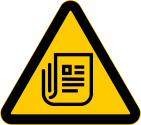

#  Toxic News

This repo contains the code for https://toxicnews.dcferreira.com,
a website enabling automatic ranking of online media outlets
using machine learning models.

Once per day, the headlines from the frontpage of multiple online media outlets
are scraped, and sent to machine learning models.
The results are displayed in the website.

For more information, check out https://toxicnews.dcferreira.com/about.html.


## Setup

Note that if you just want to look at the results, you don't need to install this!
Just access the frontend at https://toxicnews.dcferreira.com.

If you do want to set it up locally, you need [hatch](https://hatch.pypa.io/) installed.
The main entrypoint can be executed with

```bash
hatch run cli --help
```

If you want to contribute to the project, please set up also the git pre-commit hooks
before you start making changes.
Doing that will guarantee a consistent style and basic code quality.
You can set up the pre-commit hooks with:

```bash
hatch run pre-commit install
```
