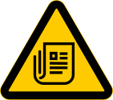

#  Toxic News

This repo contains the code for https://toxicnews.dcferreira.com,
a website enabling automatic ranking of online media outlets
using machine learning models.

Once per day, the headlines from the frontpage of multiple online media outlets
are scraped, and sent to machine learning models.
The results are displayed in the website.

For more information, check out https://toxicnews.dcferreira.com/about.html.


## Setup

Note that if you just want to look at the results, you don't need to install this!
Just access the frontend at https://toxicnews.dcferreira.com.

If you do want to set it up locally, you need [uv](https://docs.astral.sh/uv/) installed.
The main entrypoint can be executed with

```bash
uv sync
uv run poe cli --help
```

Development tasks are defined with [poe the poet](https://poethepoet.natn.io/)
in `pyproject.toml`. Run `uv run poe` with no arguments to list them all; the
main ones are:

| Task | What it does |
| --- | --- |
| `poe cov` | tests (excluding the `slow` and `integration` markers) with coverage |
| `poe no-cov` | the same tests without coverage |
| `poe integration` / `poe slow` | the corresponding marker groups |
| `poe full` | the whole test suite in parallel |
| `poe lint` | `ruff check` plus `ruff format --check` |
| `poe format` | `ruff check --fix` plus `ruff format` |
| `poe types` | `ty check` |
| `poe cli` | run the CLI |
| `poe build` / `poe serve-docker` / `poe push` | build, run and publish the container image |
| `poe update-styles` | rebuild the Tailwind stylesheet |
| `poe explore` | open the notebook environment (`uv sync --extra explore` first) |

If you want to contribute to the project, please set up also the git pre-commit hooks
before you start making changes.
Doing that will guarantee a consistent style and basic code quality.
You can set up the pre-commit hooks with:

```bash
uv run pre-commit install
```

### Dependency constraints

The runtime pins are from 2023 and no longer resolve to a working environment on
their own, so `[tool.uv] constraint-dependencies` in `pyproject.toml` holds
`transformers`, `huggingface_hub` and `click` at compatible versions. Don't
remove them without upgrading `optimum` and `typer` at the same time.
