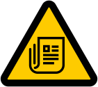

#  Toxic News

[](https://pypi.org/project/toxic-news)
[](https://pypi.org/project/toxic-news)

-----

**Table of Contents**

- [Installation](#installation)
- [License](#license)

## Installation

```console
pip install toxic-news
```

## License

`toxic-news` is distributed under the terms of the [MIT](https://spdx.org/licenses/MIT.html) license.
